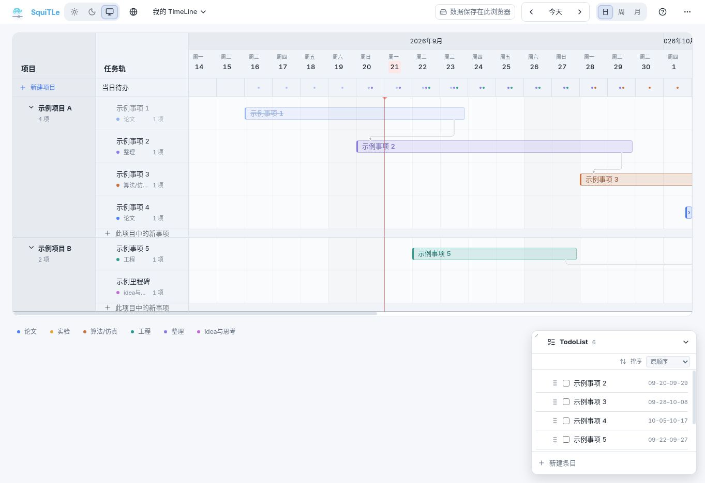

<p align="center">
  
</p>

<h1 align="center">SquiTLe</h1>

<p align="center">
  <strong>Schedule quickly in TimeLine</strong><br>
  把项目、事项、里程碑、依赖关系和 TodoList 放进同一条时间线。
</p>

<p align="center">
  <a href="https://timeline-planner.blah330903.chatgpt.site">直接使用</a> ·
  <a href="#主要功能">主要功能</a> ·
  <a href="#fork-与自定义部署">Fork 与自定义部署</a>
</p>



Squitle 是一个本地优先的个人时间轴排期工具。打开网页就能用，不需要先注册账号；如果希望在自己的设备之间同步，再按需登录或连接 WebDAV。

## 直接使用

打开 [Squitle 在线版](https://timeline-planner.blah330903.chatgpt.site) 即可开始。

默认情况下，数据只保存在当前浏览器中。你可以随时导出 JSON 备份，也可以在需要时开启云同步。

## 主要功能

- 用项目和任务轨组织事项，支持日、周、月视图。
- 直接拖动事项调整日期、轨道和项目。
- 支持里程碑、依赖连线和事项产出。
- TodoList 与时间轴共用同一份事项数据。
- 支持撤销、重做、复制、剪切和按点击位置粘贴。
- 一个账号可以保存多个 TimeLine。
- 支持中文、英文、明暗主题和外观自定义。
- 本地保存始终可用，可选 Squitle 云端或 WebDAV / 坚果云同步。

## 数据保存

| 使用方式 | 数据位置 | 需要注意 |
| --- | --- | --- |
| 仅本地 | 当前浏览器的本地存储 | 清除浏览器数据或更换设备时不会自动迁移 |
| Squitle 云端 | 官方站点的个人账号空间 | 需要登录，仅用于自己的设备同步 |
| WebDAV / 坚果云 | 你指定的 WebDAV 文件 | 连接信息只保存在当前设备 |

无论使用哪种方式，都建议定期导出 JSON 备份。更完整的数据格式和冲突处理规则见 [数据与同步说明](docs/data-and-sync.md)。

## Fork 与自定义部署

如果你想修改界面、功能或品牌，可以 Fork 这个仓库，做成自己的版本。

需要准备：

- Node.js 22.13 或更高版本
- pnpm 11

```bash
pnpm install
pnpm dev
```

提交或部署前可以运行：

```bash
pnpm check
```

仅本地模式不需要数据库或账号。Fork 后不会自动获得 Squitle 官方云同步；如果需要账号同步，请接入自己的身份系统和数据库。

仓库中包含 WebDAV 实现，但 WebDAV 代理目前仍使用官方站点的身份校验。自行部署时，需要替换这部分校验逻辑。项目暂时也没有提供适用于所有平台的一键部署模板。

## 项目结构

```text
app/                 页面入口、路由和同步 API
features/            时间轴、事项和 TodoList 等功能
components/          共享组件和基础 UI
lib/domain/          事项、轨道、依赖和 TodoList 规则
lib/persistence/     数据格式、本地存储和 TimeLine 索引
lib/sync/            云端、CloudBase 和 WebDAV 适配
lib/presentation/    外观、布局、日期表头和国际化
db/ + drizzle/       云端数据库定义与迁移
tests/               核心规则回归测试
docs/                架构、同步和开发说明
```

想参与修改的话，可以先看看 [贡献说明](CONTRIBUTING.md) 和 [项目架构](docs/architecture.md)。

## 项目状态

Squitle 目前处于个人试用和公开预览阶段。核心功能已经可以使用，但功能、数据格式和部署方式仍可能继续调整。

请保管好自己的数据，不论是通过导出导入json还是云同步的方式。

如果使用中遇到重要问题，可以发邮件到 [tzhu_sh@163.com](mailto:tzhu_sh@163.com)。我会尽量查看，但因为平时课程和科研事务比较多，可能无法逐封回复，也无法保证处理时间。普通建议和想法同样欢迎。

## License

Squitle 使用 [MIT License](LICENSE)。你可以 Fork、修改和部署自己的版本，保留许可证与版权声明即可。
