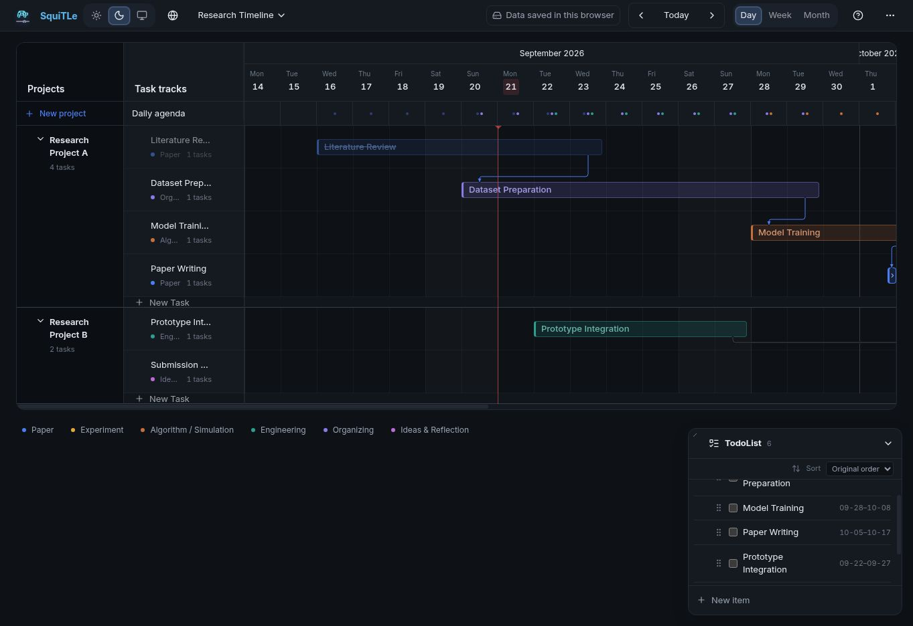

<p align="center">
  <a href="README.md">English</a> | <a href="README.zh-CN.md">简体中文</a>
</p>

<p align="center">
  
</p>

<h1 align="center">SquiTLe</h1>

<p align="center">
  <strong>Schedule quickly in TimeLine</strong><br>
  Projects, tasks, milestones, dependencies, and your TodoList—on one timeline.
</p>

<p align="center">
  <a href="https://timeline-planner.blah330903.chatgpt.site">Use SquiTLe</a> ·
  <a href="#features">Features</a> ·
  <a href="#fork-and-customize">Fork & customize</a>
</p>



SquiTLe is a local-first personal timeline planner. Open the website and start planning—no account required. Sign in or connect WebDAV only when you want to sync across devices.

## Just want to use it?

Open the [SquiTLe web app](https://timeline-planner.blah330903.chatgpt.site). Nothing to install.

By default, your data stays in this browser. You can export a JSON backup at any time and enable sync later if you need it.

## Features

- Organize work with projects, task tracks, and day, week, or month views.
- Drag tasks to change dates, tracks, or projects.
- Add milestones, dependencies, and task outputs.
- Keep TodoList items and timeline tasks in the same data model.
- Undo, redo, copy, cut, and paste tasks at the position you choose.
- Manage multiple TimeLines with one account.
- Switch between Chinese and English, light and dark themes, and custom appearance options.
- Always-available local storage, with optional SquiTLe Cloud or WebDAV / Nutstore sync.

## Data and privacy

| Mode | Where your data lives | What to know |
| --- | --- | --- |
| Local only | This browser's local storage | Clearing browser data or switching devices does not move it automatically |
| SquiTLe Cloud | Your account space on the official site | Requires sign-in and is intended for syncing your own devices |
| WebDAV / Nutstore | A WebDAV file you choose | Connection details stay on the current device |

Whichever mode you use, export a JSON backup regularly. See [Data and sync](docs/data-and-sync.md) for the document format and conflict rules.

## Fork and customize

Want a different interface, feature set, or visual style? Fork this repository and make it yours.

You will need:

- Node.js 22.13 or newer
- pnpm 11

```bash
pnpm install
pnpm dev
```

Before committing or deploying:

```bash
pnpm check
```

Local-only mode needs no database or account system. A fork does not inherit the official SquiTLe Cloud service; connect your own identity provider and database if you need account-based sync.

The repository includes a WebDAV implementation, but its proxy still uses the official site's identity checks. Replace that validation when self-hosting. There is not yet a one-click deployment template for every platform.

If you publish a customized version, please replace the SquiTLe name and logo so it is not mistaken for the official site.

## Project structure

```text
app/                 Page entry points, routes, and sync APIs
features/            Timeline, task, and TodoList features
components/          Shared components and UI primitives
lib/domain/          Task, track, dependency, and TodoList rules
lib/persistence/     Document format, local storage, and TimeLine index
lib/sync/            Cloud, CloudBase, and WebDAV adapters
lib/presentation/    Appearance, layout, date headers, and i18n
db/ + drizzle/       Cloud database definitions and migrations
tests/               Core rule regression tests
docs/                Architecture, sync, and development notes
```

To contribute, start with [CONTRIBUTING.md](CONTRIBUTING.md) and the [architecture overview](docs/architecture.md).

## Project status

SquiTLe is currently a personal-use project in public preview. The core features work, but features, data formats, and deployment options may continue to change.

Please keep your own backups, whether you use JSON export/import or cloud sync.

For important problems such as data loss or the app becoming unusable, email [tzhu_sh@163.com](mailto:tzhu_sh@163.com). Coursework and research keep me busy, so I may not reply to every message or promise a response time—but feedback and ideas are always welcome.

## License

SquiTLe is available under the [MIT License](LICENSE). You may fork, modify, and deploy your own version as long as you keep the copyright and license notice.
